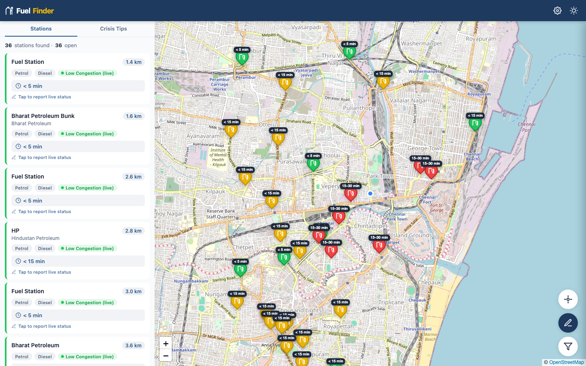
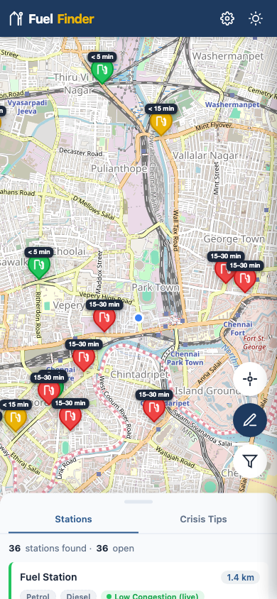

# FuelFinder — Beat the Queue

> Free, open-source web app to find the nearest open petrol bunk with the least congestion in Chennai during the fuel crisis.

<p align="center">
  
</p>
<p align="center">
  
</p>

## Features

- **251 fuel stations** across Chennai metro — every petrol bunk on OpenStreetMap
- **Live congestion data** from TomTom Traffic API, queried at each station's exact coordinates
- **Wait time estimation** — see estimated queue time (< 5 min to > 1 hour) on map markers and station cards
- **Interactive map** with color-coded markers (green = low, yellow = medium, red = high congestion)
- **Smart scheduling** — peak hours get more frequent updates, night gets fewer, all within TomTom's free 2,500 requests/day
- **Crowdsourced reports** — users can report fuel availability, congestion, and wait times
- **Offline resilient** — silently falls back to cached data when offline (no annoying banners)
- **Dark mode** support
- **Mobile-first** — draggable bottom sheet, responsive design
- **100% free** — GitHub Pages hosting, GitHub Actions automation, TomTom free tier

## Live Demo

**[mithunsinghtocode.github.io/petrol_bunk_congestion](https://mithunsinghtocode.github.io/petrol_bunk_congestion)**

## How It Works

### Architecture

```
User's Browser                    GitHub Actions (every 5-10 min)
┌──────────────┐                  ┌───────────────────────┐
│  Leaflet Map │◄── reads ───────│  data/traffic.json     │
│  + Station   │    static JSON  │  (committed by bot)    │
│    Cards     │                  └───────┬───────────────┘
└──────────────┘                          │
                                          ▼
                                  ┌───────────────────────┐
                                  │  scripts/fetch_traffic │
                                  │  .py                   │
                                  │  • TomTom Traffic API  │
                                  │  • Smart scheduling    │
                                  │  • Priority rotation   │
                                  └───────────────────────┘
```

1. **GitHub Actions** runs `fetch_traffic.py` every 5–10 minutes
2. The script queries **TomTom Traffic Flow API** at each station's lat/lng coordinates
3. Speed ratio determines congestion: `1 - (currentSpeed / freeFlowSpeed)`
4. Results are committed to `data/traffic.json` and served via GitHub Pages
5. The browser reads the static JSON — **no API keys exposed to users**

### Smart Scheduling (IST)

| Time Slot | Frequency | Batch Size | Daily Requests |
|-----------|-----------|------------|----------------|
| Peak AM (7–10) | Every 5 min | 16 stations | 576 |
| Mid-day (10–1) | Every 5 min | 12 stations | 432 |
| Afternoon (1–5) | Every 5 min | 10 stations | 480 |
| Peak PM (5–9) | Every 5 min | 16 stations | 768 |
| Evening (9–11) | Every 10 min | 8 stations | 96 |
| Night (11–7) | Every 15 min | 5 stations | 160 |
| **Total** | | | **~2,500** |

### Station Priority

Stations are classified into priority tiers that determine refresh frequency:

- **High** (178 stations) — Major brands: IOCL, BPCL, HPCL, Shell, BP
- **Medium** (23 stations) — Other named/branded stations
- **Low** (50 stations) — Unnamed or unbranded stations

High-priority stations appear 3x more in the rotation queue.

## Setup & Deployment

### Prerequisites

- A GitHub account (free)
- A [TomTom Developer](https://developer.tomtom.com/) account (free — 2,500 requests/day)

### Step 1: Fork & Clone

```bash
git clone https://github.com/mithunsinghtocode/petrol_bunk_congestion.git
cd petrol_bunk_congestion
```

### Step 2: Add TomTom API Key

1. Go to your repo on GitHub → **Settings** → **Secrets and variables** → **Actions**
2. Click **New repository secret**
3. Name: `TOMTOM_API_KEY`
4. Value: Your TomTom API key from [developer.tomtom.com](https://developer.tomtom.com/)

### Step 3: Enable GitHub Pages

1. Go to **Settings** → **Pages**
2. Source: **Deploy from a branch**
3. Branch: `main` / `/ (root)`
4. Save — your site will be live at `https://<username>.github.io/petrol_bunk_congestion`

### Step 4: Enable GitHub Actions

1. Go to **Actions** tab in your repo
2. Enable workflows if prompted
3. The `Refresh Traffic Data` workflow will run automatically every 10 minutes
4. You can also trigger it manually from the Actions tab → **Run workflow**

### Step 5 (Optional): External Cron for Reliable 5-min Updates

GitHub throttles `*/5` cron on free repos. For reliable 5-minute triggering:

1. Create a **GitHub Personal Access Token** (Fine-grained):
   - Settings → Developer settings → Personal access tokens → Fine-grained tokens
   - Repository: select your fork
   - Permissions: Actions (Read & Write)

2. Sign up at [cron-job.org](https://cron-job.org) (free)

3. Create a cron job:
   - **URL**: `https://api.github.com/repos/<username>/petrol_bunk_congestion/actions/workflows/traffic-refresh.yml/dispatches`
   - **Schedule**: Every 5 minutes
   - **Method**: POST
   - **Body**: `{"ref":"main"}`
   - **Headers**:
     ```
     Authorization: Bearer YOUR_GITHUB_PAT
     Accept: application/vnd.github+json
     Content-Type: application/json
     User-Agent: FuelFinder-Cron
     ```

## Project Structure

```
petrol_bunk_congestion/
├── index.html                  # Single-page app
├── css/style.css               # Mobile-first styles + dark mode
├── js/
│   ├── app.js                  # Main app controller
│   ├── stations.js             # Overpass API + fallback loading
│   ├── traffic.js              # Traffic data + wait time estimation
│   ├── ui.js                   # Bottom sheet, modals, interactions
│   ├── reports.js              # Crowdsourced report storage
│   └── utils.js                # Helpers (distance, labels, etc.)
├── scripts/
│   └── fetch_traffic.py        # Smart traffic fetcher (GitHub Actions)
├── data/
│   ├── traffic.json            # Live traffic data (auto-updated)
│   ├── stations_cache.json     # 251 Chennai stations (bundled fallback)
│   └── rotation_state.json     # Rotation pointer for priority scheduling
├── .github/workflows/
│   └── traffic-refresh.yml     # GitHub Actions workflow
└── assets/
    └── screenshot.png          # App screenshot
```

## Tech Stack

| Layer | Technology | Cost |
|-------|-----------|------|
| Frontend | Leaflet.js + OpenStreetMap | Free |
| Station Data | Overpass API (OpenStreetMap) | Free |
| Traffic Data | TomTom Traffic Flow API | Free (2,500/day) |
| Hosting | GitHub Pages | Free |
| Automation | GitHub Actions | Free (2,000 min/month) |
| Cron Trigger | cron-job.org (optional) | Free |

## Wait Time Estimation

Wait times are derived from the speed ratio at each station's coordinates:

| Speed Ratio | Congestion | Est. Wait Time |
|-------------|-----------|----------------|
| < 0.2 | Very High | > 60 min |
| 0.2 – 0.5 | High | 30–60 min |
| 0.5 – 0.8 | Medium | 15–30 min |
| 0.8 – 0.95 | Low | < 15 min |
| > 0.95 | Minimal | < 5 min |

## Contributing

1. Fork the repo
2. Create a feature branch: `git checkout -b feature/my-feature`
3. Commit your changes
4. Push and open a Pull Request

## License

MIT License — free to use, modify, and distribute.

---

Built with care during the fuel crisis. Stay safe, Chennai.
